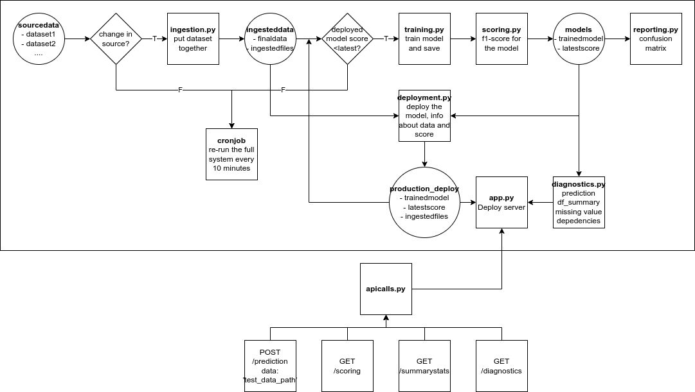

# A DYNAMIC RISK ASSESSMENT SYSTEM FOR CLIENTS ATTRITION
## Overview
This is the final project of Machine Learning DevOps Engineer Nanodegree Program.

The target is to create, deploy, and monitor a risk assessment ML model that will estimate the attrition risk of each of the company's 10,000 clients. If the model is accurate, it will enable the client managers to contact the clients with the highest risk and avoid losing clients and revenue.

Since the industry is dynamic and constantly changing, there are process and scripts to regularly re-train, re-deploy, monitor, and report on the model.

## Steps


## Running Files
First, install the necessary library:
```bash
pip install -r requirements.txt
```
To start the server, run the command:
```bash
python app.py
```
Making API calls:
```bash
python apicalls.py
```
To run the whole process, copy the cron job in `cronjob.txt` to the system crontab:
```bash
*/10  * * * * python fullprocess.py
```
